Gallery
=======

A visual tour of lifegraph features, from the basics to advanced layouts.

Getting Started
---------------

Basic grid
~~~~~~~~~~

Every square represents one week of your life.

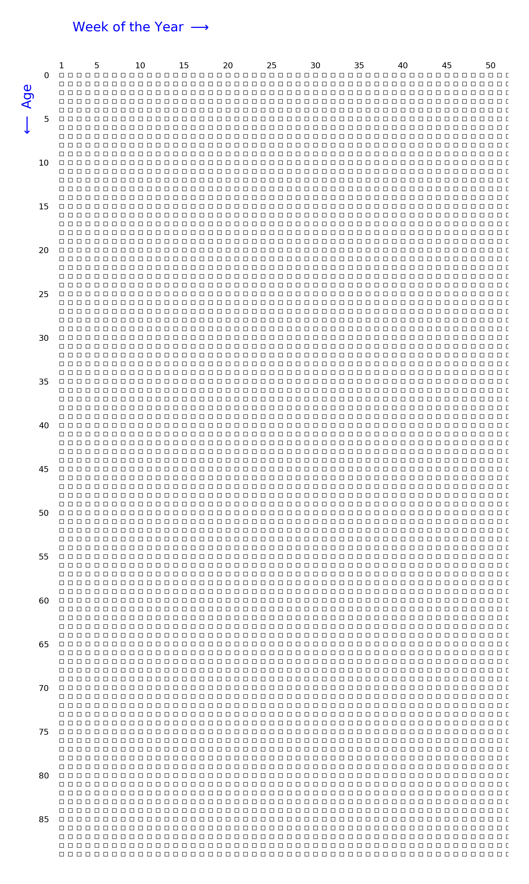

.. code-block:: python

   from lifegraph import Lifegraph
   from lifegraph.configuration import Papersize
   from datetime import date

   birthday = date(1990, 11, 1)
   g = Lifegraph(birthday, dpi=300, size=Papersize.A4,
                  axes_rect=[.1, .1, .8, .8])
   g.save("grid.png")

Adding a title
~~~~~~~~~~~~~~

Place text above the grid.

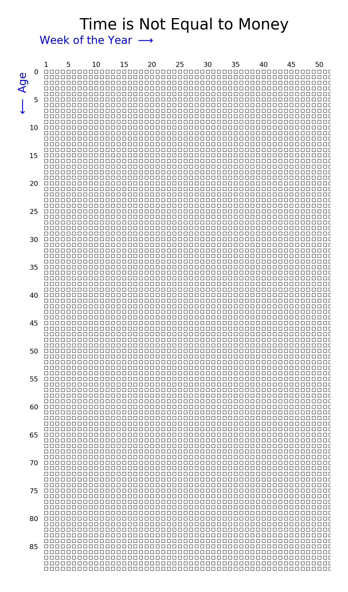

.. code-block:: python

   from lifegraph import Lifegraph
   from lifegraph.configuration import Papersize
   from datetime import date

   birthday = date(1990, 11, 1)
   g = Lifegraph(birthday, dpi=300, size=Papersize.A4)
   g.add_title("Time is Not Equal to Money")
   g.save("grid_with_title.png")

Adding a watermark
~~~~~~~~~~~~~~~~~~

Overlay faint diagonal text across the grid.

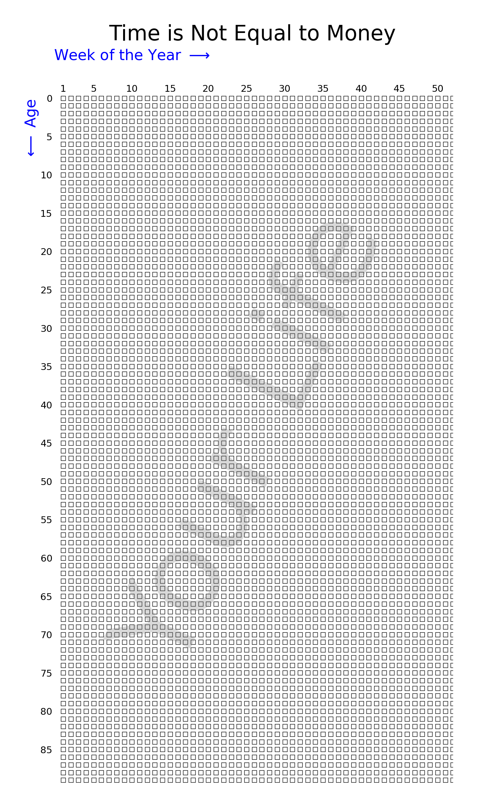

.. code-block:: python

   from lifegraph import Lifegraph
   from lifegraph.configuration import Papersize
   from datetime import date

   birthday = date(1990, 11, 1)
   g = Lifegraph(birthday, dpi=300, size=Papersize.A4)
   g.add_title("Time is Not Equal to Money")
   g.add_watermark("Your Life")
   g.save("grid_with_watermark.png")

Changing the maximum age
~~~~~~~~~~~~~~~~~~~~~~~~

The grid has 90 rows by default. Set ``max_age`` to change it, and
``show_max_age_label()`` to display the number at the bottom.

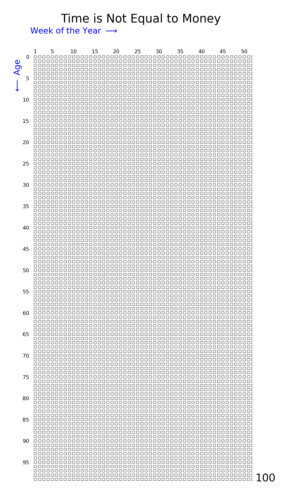

.. code-block:: python

   from lifegraph import Lifegraph
   from lifegraph.configuration import Papersize
   from datetime import date

   birthday = date(1990, 11, 1)
   g = Lifegraph(birthday, dpi=300, size=Papersize.A4, max_age=100)
   g.add_title("Time is Not Equal to Money")
   g.show_max_age_label()
   g.save("grid_maxage.png")

Showing a sub-range with ``min_age``
~~~~~~~~~~~~~~~~~~~~~~~~~~~~~~~~~~~~~

Display only a portion of the grid -- useful for focusing on a specific
period of life. Events outside the visible range are stored but not drawn,
and eras that cross the boundary are clipped automatically.

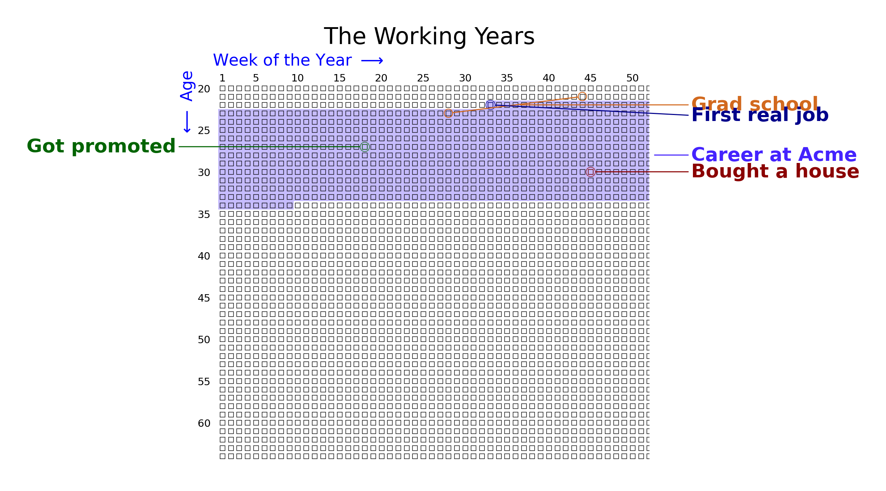

.. code-block:: python

   from lifegraph import Lifegraph, Side
   from lifegraph.configuration import Papersize
   from datetime import date

   birthday = date(1990, 11, 1)
   g = Lifegraph(birthday, dpi=300, size=Papersize.A4,
                  max_age=65, min_age=20)

   g.add_title("The Working Years")

   g.add_life_event("First real job", date(2013, 6, 15), color="#00008B")
   g.add_life_event("Got promoted", date(2018, 3, 1),
                     color="#006400", side=Side.LEFT)
   g.add_life_event("Bought a house", date(2021, 9, 10), color="#8B0000")

   g.add_era("Career at Acme", date(2013, 6, 15), date(2025, 1, 1),
             color="#4423fe")
   g.add_era_span("Grad school", date(2012, 9, 1), date(2014, 5, 15),
                   color="#D2691E")

   g.save("grid_min_age.png")

Events & Eras
-------------

Life events
~~~~~~~~~~~

A life event is a labeled point on the grid. Colors can be hex strings,
RGB tuples, or named colors. Use ``side`` to force label placement.

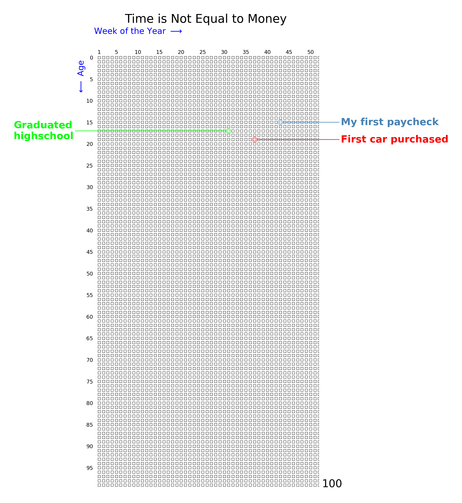

.. code-block:: python

   from lifegraph import Lifegraph, Side
   from lifegraph.configuration import Papersize
   from datetime import date

   birthday = date(1990, 11, 1)
   g = Lifegraph(birthday, dpi=300, size=Papersize.A4, max_age=100)

   g.add_title("Time is Not Equal to Money")
   g.show_max_age_label()

   # a random color will be chosen if you don't provide one
   g.add_life_event("My first paycheck", date(2006, 8, 23))

   # colors can be hex strings; use side= to control label placement
   g.add_life_event("Graduated\nhighschool", date(2008, 6, 2),
                     color="#00FF00", side=Side.LEFT)

   # or RGB tuples
   g.add_life_event("First car purchased", date(2010, 7, 14),
                     color=(1, 0, 0))

   g.save("grid_life_event.png")

Eras
~~~~

Eras shade a rectangular region of the grid behind the squares.

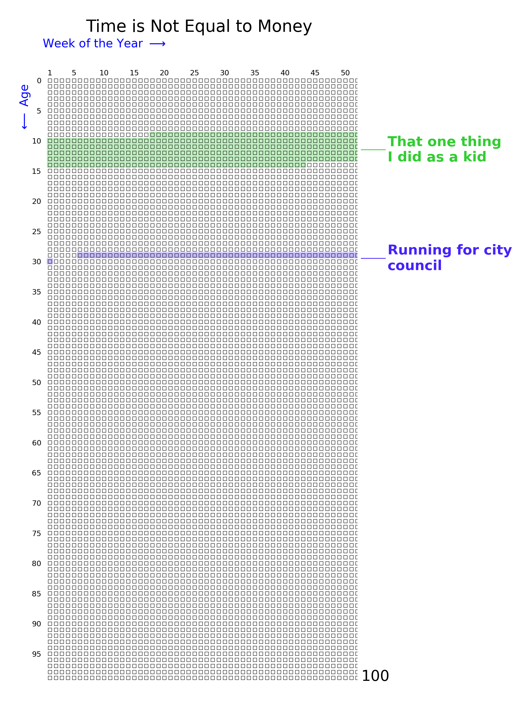

.. code-block:: python

   from lifegraph import Lifegraph
   from lifegraph.configuration import Papersize
   from datetime import date

   birthday = date(1990, 11, 1)
   g = Lifegraph(birthday, dpi=300, size=Papersize.A4, max_age=100)

   g.add_title("Time is Not Equal to Money")
   g.show_max_age_label()

   # random color will be used
   g.add_era("That one thing\nI did as a kid",
             date(2000, 3, 4), date(2005, 8, 22))

   # you can also choose the color
   g.add_era("Running for city\ncouncil",
             date(2019, 12, 10), date(2020, 11, 5), color="#4423fe")

   g.save("grid_era.png")

Era spans
~~~~~~~~~

Era spans draw a dumbbell shape -- circles at the start and end connected
by a line.

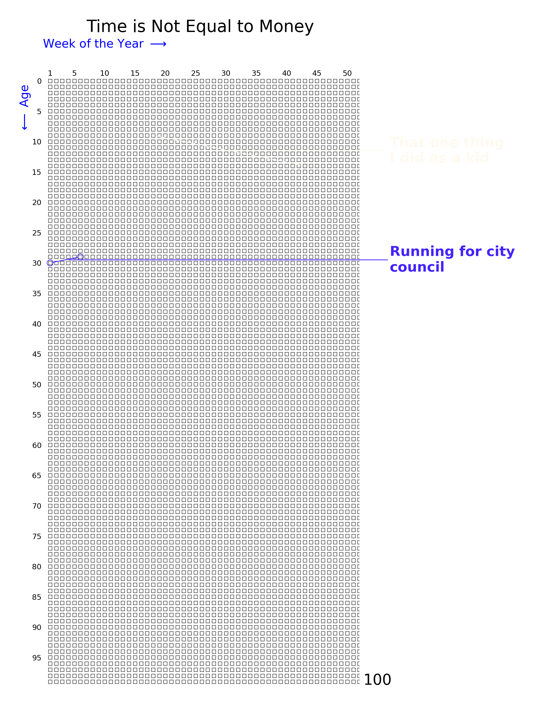

.. code-block:: python

   from lifegraph import Lifegraph
   from lifegraph.configuration import Papersize
   from datetime import date

   birthday = date(1990, 11, 1)
   g = Lifegraph(birthday, dpi=300, size=Papersize.A4, max_age=100)

   g.add_title("Time is Not Equal to Money")
   g.show_max_age_label()

   # random color will be used
   g.add_era_span("That one thing\nI did as a kid",
                   date(2000, 3, 4), date(2005, 8, 22))

   # you can also choose the color
   g.add_era_span("Running for city\ncouncil",
                   date(2019, 12, 10), date(2020, 11, 5), color="#4423fe")

   g.save("grid_era_span.png")

Customization
-------------

Grid style
~~~~~~~~~~

Override the default marker shape, size, and axis labels through
``g.settings.rcParams``.

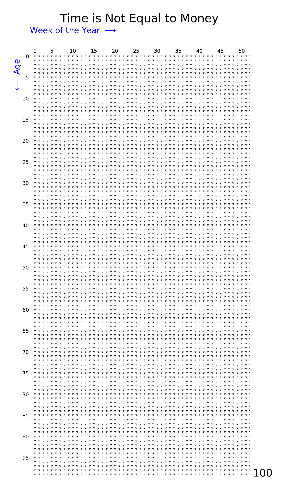

.. code-block:: python

   from lifegraph import Lifegraph
   from lifegraph.configuration import Papersize
   from datetime import date

   birthday = date(1990, 11, 1)
   g = Lifegraph(birthday, dpi=300, size=Papersize.A4, max_age=100)

   g.add_title("Time is Not Equal to Money")
   g.show_max_age_label()

   g.settings.rcParams["lines.marker"] = "v"
   g.settings.rcParams["lines.markersize"] = 2.0

   g.save("grid_customization.png")

Label placement
~~~~~~~~~~~~~~~

Control where annotation labels appear using ``side`` or ``hint``.

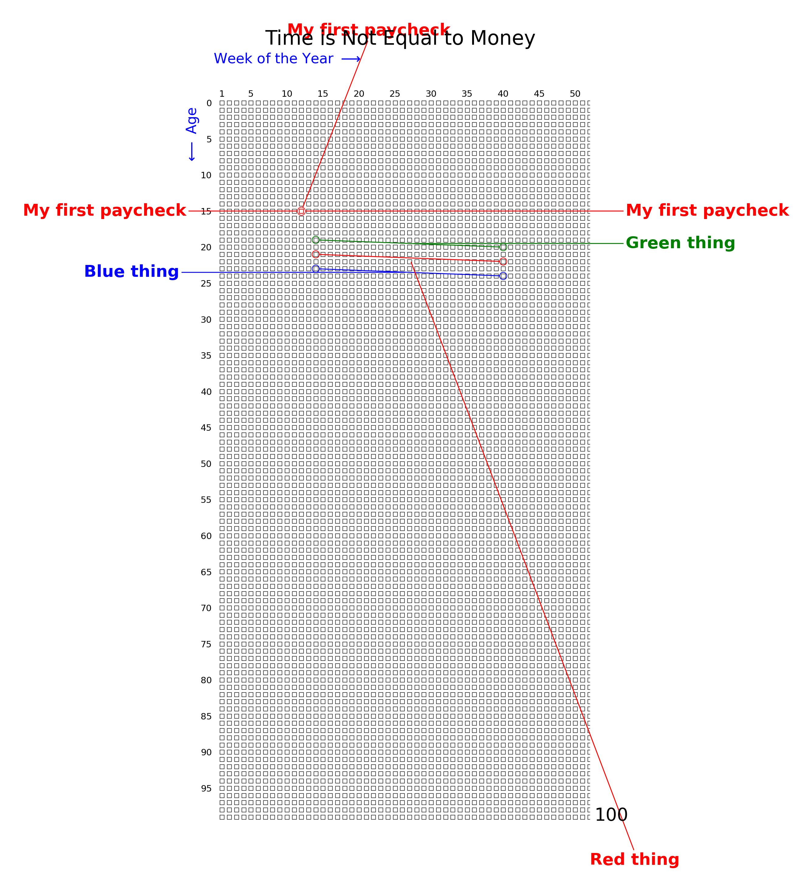

.. code-block:: python

   from lifegraph import Lifegraph, Side
   from lifegraph.configuration import Papersize
   from datetime import date

   birthday = date(1990, 11, 1)
   g = Lifegraph(birthday, dpi=300, size=Papersize.A4, max_age=100)

   g.add_title("Time is Not Equal to Money")
   g.show_max_age_label()

   # default placement
   g.add_life_event("My first paycheck", date(2006, 1, 23), color="r")

   # a hint, in data coordinates
   g.add_life_event("My first paycheck", date(2006, 1, 23),
                     color="r", hint=(10, -10))

   # force to a side
   g.add_life_event("My first paycheck", date(2006, 1, 23),
                     color="r", side=Side.RIGHT)

   # era spans accept hints and sides too
   g.add_era_span("Green thing", date(2010, 2, 1),
                   date(2011, 8, 1), color="g")
   g.add_era_span("Red thing", date(2012, 2, 1),
                   date(2013, 8, 1), color="r", hint=(52, 105))
   g.add_era_span("Blue thing", date(2014, 2, 1),
                   date(2015, 8, 1), color="b", side=Side.LEFT)

   g.save("placement.png")

Image overlay
~~~~~~~~~~~~~

Overlay an image that fills the grid area.

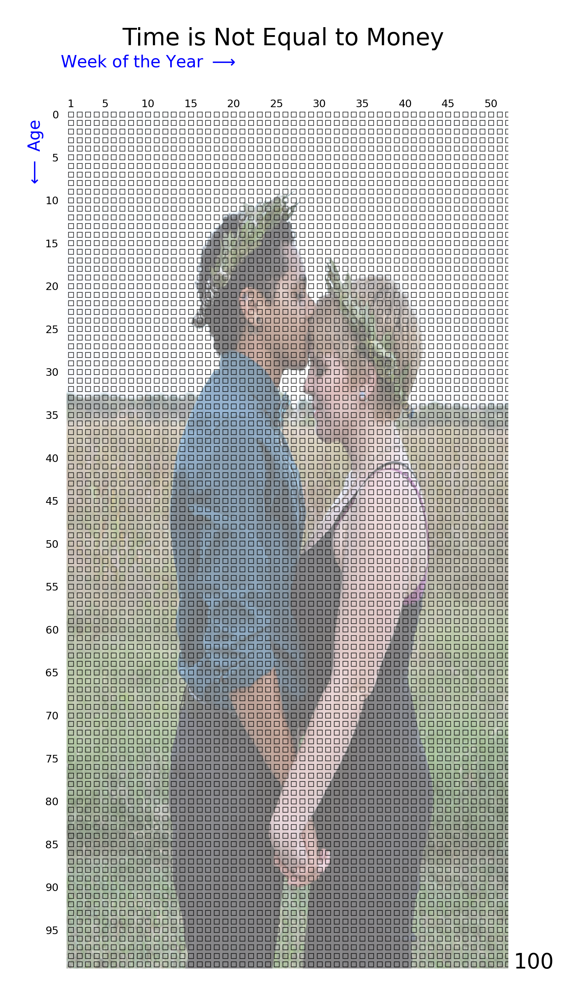

.. code-block:: python

   from lifegraph import Lifegraph
   from lifegraph.configuration import Papersize
   from datetime import date

   birthday = date(1990, 11, 1)
   g = Lifegraph(birthday, dpi=300, size=Papersize.A4, max_age=100)

   g.add_title("Time is Not Equal to Money")
   g.show_max_age_label()

   g.add_image("photo.jpg", alpha=0.5)

   g.save("grid_add_image.png")

Advanced
--------

Provided axes
~~~~~~~~~~~~~

Pass your own matplotlib axes to compose multiple life graphs on one figure
or mix life graphs with other plots. Use ``g.draw()`` instead of
``g.save()`` and manage the figure lifecycle yourself.

**Single axes**

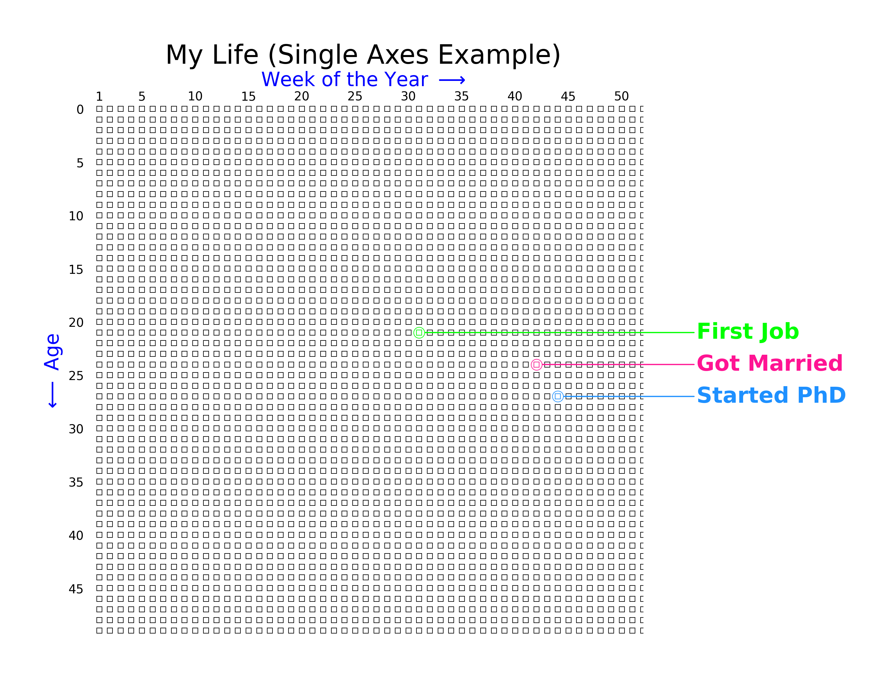

.. code-block:: python

   import matplotlib.pyplot as plt
   from lifegraph import Lifegraph
   from datetime import date

   fig, ax = plt.subplots(figsize=(10, 8))

   birthday = date(1990, 11, 1)
   g = Lifegraph(birthday, max_age=50, ax=ax)

   g.add_life_event("First Job", date(2012, 6, 1), color="#00FF00")
   g.add_life_event("Got Married", date(2015, 8, 15), color="#FF1493")
   g.add_life_event("Started PhD", date(2018, 9, 1), color="#1E90FF")

   g.add_title("My Life (Single Axes Example)")
   g.draw()

   fig.savefig("provided_axes_single.png", dpi=300)
   plt.close(fig)

**Multiple subplots**

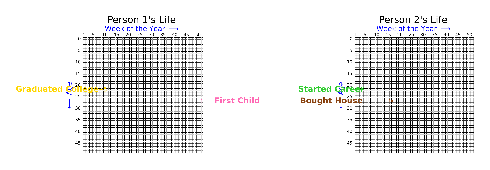

.. code-block:: python

   import matplotlib.pyplot as plt
   from lifegraph import Lifegraph
   from datetime import date

   fig, (ax1, ax2) = plt.subplots(1, 2, figsize=(16, 8))

   g1 = Lifegraph(date(1985, 3, 15), max_age=50, ax=ax1)
   g1.add_life_event("Graduated College", date(2007, 5, 20), color="#FFD700")
   g1.add_life_event("First Child", date(2012, 3, 10), color="#FF69B4")
   g1.add_title("Person 1's Life")

   g2 = Lifegraph(date(1992, 7, 20), max_age=50, ax=ax2)
   g2.add_life_event("Started Career", date(2014, 8, 1), color="#32CD32")
   g2.add_life_event("Bought House", date(2019, 11, 5), color="#8B4513")
   g2.add_title("Person 2's Life")

   g1.draw()
   g2.draw()

   plt.tight_layout()
   fig.savefig("provided_axes_multiple.png", dpi=300)
   plt.close(fig)

**Mixing with other plots**

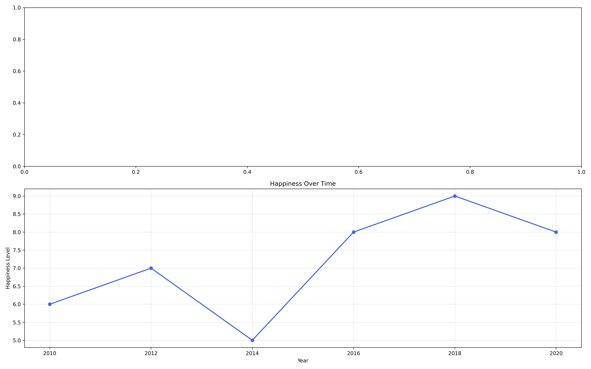

.. code-block:: python

   import matplotlib.pyplot as plt
   from lifegraph import Lifegraph
   from datetime import date

   fig = plt.figure(figsize=(16, 10))

   ax1 = fig.add_subplot(2, 1, 1)
   g = Lifegraph(date(1988, 5, 10), max_age=50, ax=ax1)
   g.add_life_event("Career Change", date(2015, 1, 1), color="#FF6347")
   g.add_title("Life Timeline")
   g.draw()

   ax2 = fig.add_subplot(2, 1, 2)
   years = [2010, 2012, 2014, 2016, 2018, 2020]
   happiness = [6, 7, 5, 8, 9, 8]
   ax2.plot(years, happiness, marker="o", linewidth=2, color="#4169E1")
   ax2.set_xlabel("Year")
   ax2.set_ylabel("Happiness Level")
   ax2.set_title("Happiness Over Time")
   ax2.grid(True, alpha=0.3)

   plt.tight_layout()
   fig.savefig("provided_axes_mixed.png", dpi=300)
   plt.close(fig)

Saving and loading configurations
~~~~~~~~~~~~~~~~~~~~~~~~~~~~~~~~~~

Export a lifegraph to a portable JSON or YAML file and recreate the exact
same graph later. Useful for sharing configurations or version-controlling
your life data separately from code.

.. code-block:: python

   from lifegraph import Lifegraph
   from lifegraph.configuration import Papersize
   from datetime import date

   birthday = date(1990, 11, 1)
   g = Lifegraph(birthday, dpi=300, size=Papersize.Letter)
   g.add_life_event("Graduated", date(2012, 5, 20), color="#00FF00")
   g.add_era("College", date(2008, 9, 1), date(2012, 5, 15), color="blue")
   g.add_title("My Life")

   # Export -- format is inferred from extension (.json or .yaml/.yml)
   g.save_config("my_life.json")

   # Include axis styling in the export
   g.format_x_axis(text="Weeks", color="red", fontsize=14)
   g.save_config("my_life_styled.json", include_styling=True)

   # Import and render
   g2 = Lifegraph.from_config("my_life.json")
   g2.save("my_life.png")

YAML requires the optional ``pyyaml`` package (``pip install lifegraph[yaml]``).

Complete Example
----------------

Putting several features together into one graph.

.. image:: ../examples/images/alife.png
   :alt: Complete life graph
   :align: center
   :width: 60%

.. code-block:: python

   from lifegraph import Lifegraph, Side
   from lifegraph.configuration import Papersize
   from lifegraph.core import Point
   from datetime import date

   birthday = date(1995, 11, 20)
   g = Lifegraph(birthday, dpi=300, size=Papersize.Letter,
                  label_space_epsilon=1)

   g.add_life_event("Won an award", date(2013, 11, 20), "#014421")
   g.add_life_event("Hiked the Rocky Mountains", date(2014, 2, 14),
                     "#DC143C", hint=(25, -3))
   g.add_life_event("Ran first marathon", date(2017, 9, 11), "#990000")
   g.add_life_event("Built a canoe", date(2018, 12, 8), "#87CEFA")
   g.add_life_event("Started working at\nEcosia", date(2019, 1, 7),
                     "#00008B")

   g.add_era("Elementary School", date(2001, 8, 24),
             date(2007, 6, 5), "r")
   g.add_era("High School", date(2010, 8, 24),
             date(2014, 6, 5), "#00838f")
   g.add_era("College", date(2014, 9, 1), date(2018, 12, 14),
             (80 / 255, 0, 0), side=Side.LEFT)

   g.add_era_span("Longest vacation ever", date(2016, 8, 22),
                   date(2016, 12, 16), "#D2691E", hint=Point(53, 28))

   g.add_title("The Life of Someone")
   g.show_max_age_label()

   g.save("alife.png")
