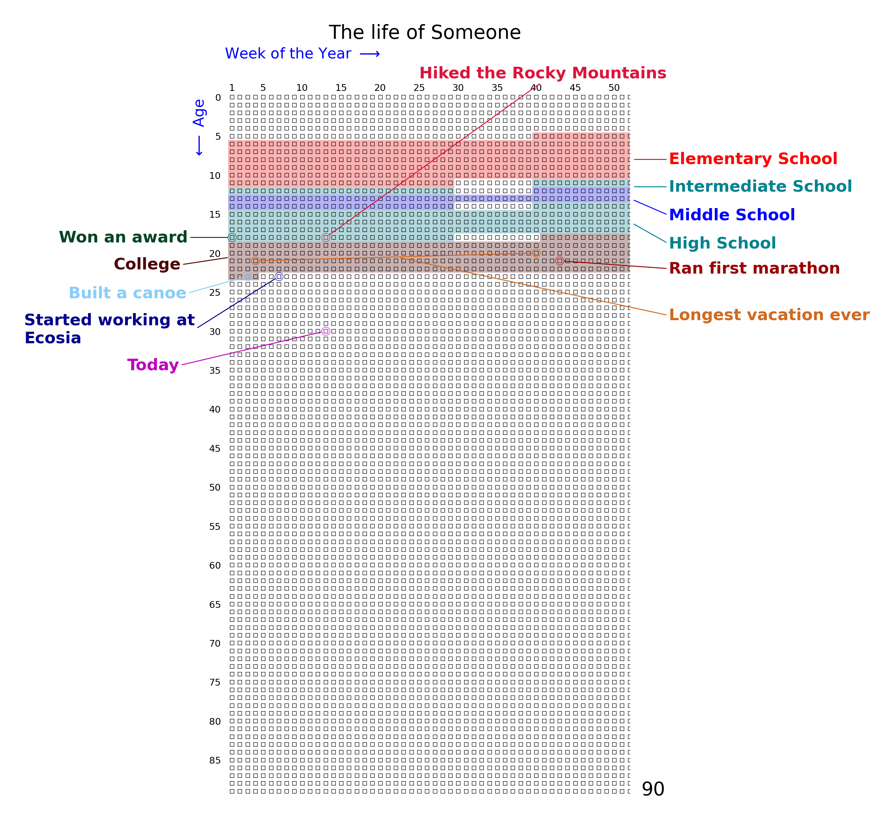

lifegraph
=========

**lifegraph** visualises your life as a grid of weekly squares, inspired by
the `Wait But Why <https://waitbutwhy.com/2014/05/life-weeks.html>`_ blog
post.

Installation
------------

.. code-block:: bash

   pip install lifegraph

Quick start
-----------

.. code-block:: python

   from lifegraph import Lifegraph
   from datetime import date

   g = Lifegraph(date(1990, 11, 1))
   g.add_title("My Life")
   g.save("my_life.png")

.. toctree::
   :maxdepth: 2
   :caption: Contents

   tutorial
   api

Indices and tables
------------------

* :ref:`genindex`
* :ref:`modindex`
* :ref:`search`
